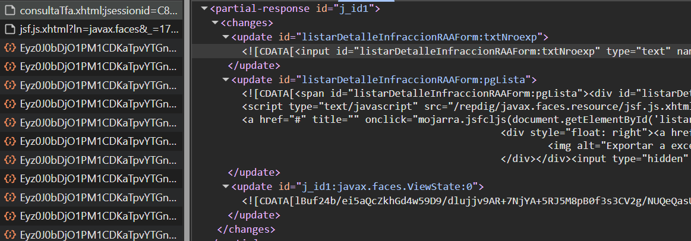
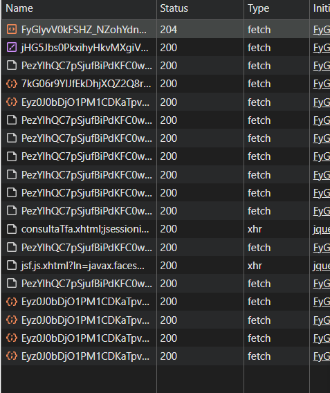
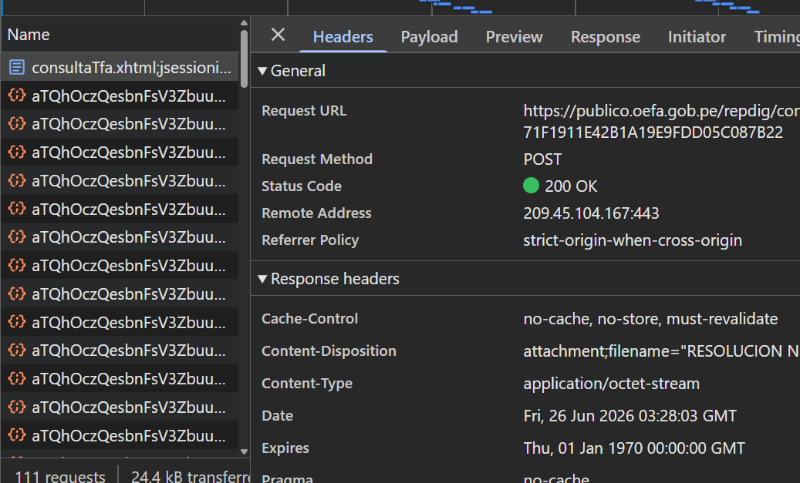
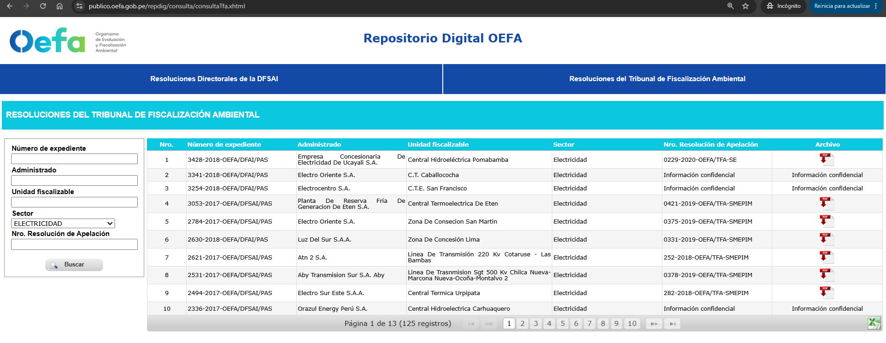

# Reconocimiento del flujo HTTP — OEFA / TFA

> Notas de la fase de exploración (DevTools → Network). El objetivo es entender
> cómo navega el sitio **antes** de escribir el scraper, y dejar registradas las
> peticiones clave para poder reproducirlas con `axios`.
>
> Sitio: https://publico.oefa.gob.pe/repdig/consulta/consultaTfa.xhtml

## Resumen del flujo

```
GET inicial  ──►  extraer JSESSIONID + ViewState
     │
     ▼
POST búsqueda (PrimeFaces AJAX)  ──►  respuesta <partial-response> (XML)
     │                                   ├─ <update> con el HTML de la tabla
     │                                   └─ <update> con el ViewState NUEVO
     ▼
POST paginación (loop por páginas)  ──►  mismo formato partial-response
     │
     ▼
Descarga del PDF de cada fila  ──►  manejar 429 (backoff exponencial)
```

## 1. Tecnología del sitio

- [x] Construido con **JSF / PrimeFaces** (confirmado: el HTML referencia `PrimeFaces.ab(...)`).
- [x] La sesión se mantiene con cookie **`JSESSIONID`** (`Path=/repdig/`, `Secure`, `HttpOnly`).
- [x] El formulario es `listarDetalleInfraccionRAAForm` (POST a `consultaTfa.xhtml`).

## 2. GET inicial

- URL: `https://publico.oefa.gob.pe/repdig/consulta/consultaTfa.xhtml`
- Respuesta entrega `Set-Cookie: JSESSIONID=...` → **conservar en todas las peticiones**.
- El `ViewState` viene en un input hidden:
  `<input ... name="javax.faces.ViewState" id="j_id1:javax.faces.ViewState:0" value="...">`
  → cambia en cada respuesta; hay que extraerlo siempre.

**Campos del formulario detectados:**

| id / name | tipo | significado (a confirmar) |
|-----------|------|---------------------------|
| `listarDetalleInfraccionRAAForm:txtNroexp` | text | N° de expediente |
| `listarDetalleInfraccionRAAForm:idsector` | select | sector |
| `listarDetalleInfraccionRAAForm:btnBuscar` | button | dispara la búsqueda (AJAX) |
| `listarDetalleInfraccionRAAForm:dt` | datatable | tabla de resultados |
| `listarDetalleInfraccionRAAForm:dt_paginator_bottom` | — | paginador |

## 3. POST de búsqueda  ✅

El botón "Buscar" dispara `PrimeFaces.ab({s:"...:btnBuscar", u:"...:pgLista ...:txtNroexp"})`,
que se traduce en este POST `application/x-www-form-urlencoded`.

**URL** (con jsessionid en el path la primera vez; luego va por cookie):

```
POST https://publico.oefa.gob.pe/repdig/consulta/consultaTfa.xhtml;jsessionid=C8FB9054ECBB63687CDE960641D66764
```

**Parámetros del payload:**

```
javax.faces.partial.ajax=true
javax.faces.source=listarDetalleInfraccionRAAForm:btnBuscar
javax.faces.partial.execute=@all
javax.faces.partial.render=listarDetalleInfraccionRAAForm:pgLista listarDetalleInfraccionRAAForm:txtNroexp
listarDetalleInfraccionRAAForm:btnBuscar=listarDetalleInfraccionRAAForm:btnBuscar
listarDetalleInfraccionRAAForm=listarDetalleInfraccionRAAForm
listarDetalleInfraccionRAAForm:txtNroexp=        # texto del N° de expediente (vacío = sin filtro)
listarDetalleInfraccionRAAForm:idsector=         # sector (vacío = Todos)
listarDetalleInfraccionRAAForm:dt_scrollState=0,0
javax.faces.ViewState=<viewstate del GET inicial>
```

**Valores del combo `idsector`:** `""`=Todos · `2`=Electricidad · `3`=Hidrocarburos ·
`9`=Industria · `1`=Minería · `8`=Pesquería. Buscar con `""` trae **todos** los registros.

**Formato de la respuesta:** `<partial-response>` (XML). La tabla viene en el
`<update id="...:pgLista">` dentro de un `<![CDATA[ ... ]]>`, y el ViewState nuevo en el
`<update id="j_id1:javax.faces.ViewState:0">`. **Hay que reusar ese ViewState** en la
siguiente petición.



> 🔍 El POST real entre el ruido de beacons de tracking (es el `consultaTfa.xhtml` de tipo `xhr`):
>
> 

## 4. POST de paginación  ⬅️ PENDIENTE (pegar cURL real)

> Clic en "página 2" del paginador, capturar el POST. Anotar qué cambia respecto a la búsqueda.

```bash
# TODO: pegar aquí el cURL del POST de paginación
```

- ¿Parámetro que controla la página? (ej. `..._first`, `..._rows`) → __________ (por capturar)
- Total de resultados / páginas observados: **Todos = 1753 registros / 176 páginas**
  (10 por página). Con sector Electricidad = 125 registros / 13 páginas.
- El widget PrimeFaces declara: `paginator:{rows:10, rowCount:1753, page:0}`.

## 5. Descarga del PDF  ✅

Cada fila con archivo tiene un enlace con el UUID del documento dentro del onclick de mojarra:

```html
<a onclick="mojarra.jsfcljs(document.getElementById('listarDetalleInfraccionRAAForm'),
   {'listarDetalleInfraccionRAAForm:dt:0:j_idt63':'listarDetalleInfraccionRAAForm:dt:0:j_idt63',
    'param_uuid':'4c6b30c2-9dd8-4b61-a592-9b0ef82d83ab'},'')">
```

→ La llave del PDF es **`param_uuid`**. Las filas que dicen "Información confidencial" no
tienen enlace (no hay PDF).

Al hacer clic, mojarra arma un **form oculto y lo envía** (no es AJAX): aparece en Network
como una petición de tipo **`document`**, no XHR. El cuerpo es el mismo form de búsqueda más
dos campos clave: el `source` del link (`...:dt:0:j_idt63`) y `param_uuid`.

Payload real (`application/x-www-form-urlencoded`):

```
listarDetalleInfraccionRAAForm=listarDetalleInfraccionRAAForm
listarDetalleInfraccionRAAForm:txtNroexp=
listarDetalleInfraccionRAAForm:idsector=2
listarDetalleInfraccionRAAForm:dt_scrollState=0,0
javax.faces.ViewState=mnhgosk8SAaV…            (el ViewState de la página actual)
listarDetalleInfraccionRAAForm:dt:0:j_idt63=listarDetalleInfraccionRAAForm:dt:0:j_idt63
param_uuid=4c6b30c2-9dd8-4b61-a592-9b0ef82d83ab
```

- Método: **POST** a `…/consultaTfa.xhtml;jsessionid=…` (mismo endpoint, sesión en la URL).
- Requiere **ViewState + sesión**: es un full postback. No devuelve ViewState nuevo (termina en
  `responseComplete`), así que la descarga se hace con el ViewState de la página donde está la fila.
- `Content-Type` de la respuesta: **`application/octet-stream`**.
- `Content-Disposition`: **`attachment;filename="RESOLUCION N° 229-2020-OEFA-TFA-SE.pdf"`**
  → el servidor nos da el **nombre real**; lo usamos tal cual (sanitizado) para guardar el archivo.

El índice de la fila (`dt:0:…`) es el atributo `data-ri`, que es **absoluto**: en la página 2 las
filas son `data-ri="10"`…`19`, así que el link es `dt:10:j_idt63`, etc.



## 6. Rate limiting (429)

El reto pide manejar el 429 (Too Many Requests). Estrategia implementada (ver
`src/util/backoff.ts`), pensada para activarse aunque el sitio de desarrollo no siempre lo
dispare:

- Reintentos ante **429, 500, 502, 503, 504** y errores de red transitorios (timeout, conexión
  cortada). El resto de errores no se reintenta.
- **Backoff exponencial**: `base·2^(n-1)` con tope de 30 s y un 25 % de *jitter* para no
  reintentar en bloque.
- Si la respuesta trae **`Retry-After`** (segundos), se respeta ese tiempo en lugar del backoff.
- Tras agotar los reintentos, el documento se anota en `output/failed.json` y se sigue con el
  resto. `npm run retry` reprocesa solo esos.
- Entre descargas hay un delay base (`REQUEST_DELAY_MS`, 1 s) para no saturar el servidor.

- ¿Se reproduce el 429 en OEFA (desarrollo)? → No de forma fiable con el ritmo de 1 req/s; por eso
  el manejo se prueba con la lógica de `withRetry` y queda listo para el sitio de producción.
- ¿`Retry-After`? → Soportado si el servidor lo envía.

## Capturas

**Pantalla de resultados del sitio** (búsqueda por sector Electricidad, 125 registros,
13 páginas). Se ven las columnas que extraemos y el ícono de descarga del PDF:



**Respuesta `partial-response`** y **ubicación del POST en Network**: ver sección 3.

**Descarga del PDF** (cURL + headers `application/octet-stream` y `Content-Disposition`): ver
sección 5, captura `img/pdf-descarga.png`.

> Pendiente de capturar: un **429** si se llega a reproducir al descargar muchos PDFs seguidos
> (en OEFA no se dispara de forma fiable con el ritmo actual).
